# Dự án Website Đặt lịch hẹn Tiệm Làm Tóc

**Code name:** `virgo-14`

## I. Tổng quan dự án

### Mục tiêu

Mục tiêu của dự án này là xây dựng một website cho tiệm làm tóc địa phương, cho phép khách hàng đặt lịch hẹn online,
quản lý thông tin cá nhân và cung cấp cho nhân viên (stylist và quản lý) các công cụ để quản lý lịch hẹn, dịch vụ và
thông tin tiệm.

### Phạm vi

Phạm vi dự án bao gồm các chức năng chính như: đặt lịch hẹn, quản lý lịch hẹn, quản lý dịch vụ, quản lý stylist, quản lý
khách hàng, quản lý thông tin salon.

Việc đặt lịch hẹn sẽ được thực hiện thông qua website, chấp nhận hoặc từ chối lịch hẹn sẽ được stylist thực hiện thủ
công.

### Giả định và ràng buộc

- Website chỉ phục vụ cho tiệm làm tóc địa phương, không phải là một hệ thống quản lý lớn.
- Website chỉ phục vụ cho việc đặt lịch hẹn và quản lý thông tin cá nhân, không phải là một hệ thống quản lý salon toàn
  diện.
- Website chỉ phục vụ cho việc đặt lịch hẹn, không phải là một hệ thống quản lý nhân sự.
- Website chỉ phục vụ cho việc đặt lịch hẹn và không cung cấp dịch vụ thanh toán online.

## II. Yêu cầu chức năng

### Các tác nhân

- Hệ thống có 4 tác nhân chính: Guest, Customer, Stylist và Manager.

Code PlantUML

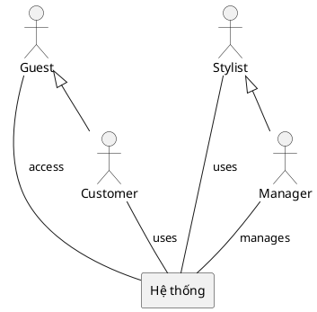

### Các chức năng chính

**Guest:**

* **Tìm kiếm dịch vụ:**  Cho phép khách tìm kiếm dịch vụ dựa trên tên, loại dịch vụ, giá cả...
* **Xem thông tin dịch vụ:** Hiển thị chi tiết về dịch vụ, bao gồm mô tả, giá cả, thời gian thực hiện.
* **Xem thông tin stylist:** Hiển thị thông tin về stylist, bao gồm kinh nghiệm, chuyên môn, ảnh đại diện...
* **Đăng nhập:** Đăng nhập vào tài khoản khách hàng đã đăng ký.
* **Đăng ký:** Tạo tài khoản khách hàng mới.
* **Xem thông tin salon:** Hiển thị thông tin về salon, bao gồm địa chỉ, số điện thoại, giờ mở cửa, hình ảnh...

**Customer:**

* **Đặt lịch hẹn:** Chọn dịch vụ, stylist, ngày giờ và đặt lịch hẹn.
* **Xem lịch hẹn:** Xem các lịch hẹn đã đặt.
* **Hủy lịch hẹn:** Hủy lịch hẹn đã đặt.
* **Đổi mật khẩu:** Thay đổi mật khẩu tài khoản.
* **Quản lý thông tin:** Cập nhật thông tin cá nhân như tên, số điện thoại.

**Stylist:**

* **Xem lịch hẹn:** Xem lịch hẹn của mình.
* **Cập nhật lịch hẹn:**
    * **Chấp nhận lịch hẹn:** Xác nhận lịch hẹn.
    * **Từ chối lịch hẹn:** Từ chối lịch hẹn.
    * **Hoàn thành hoặc đánh dấu vắng mặt:** Cập nhật trạng thái lịch hẹn.
* **Xem lịch sử lịch hẹn:** Xem các lịch hẹn đã qua.

**Manager:**

* **Quản lý khách hàng:** Xem, xóa thông tin khách hàng.
* **Quản lý stylist:** Xem, thêm, sửa, xóa thông tin stylist, quản lý lịch làm việc.
* **Quản lý dịch vụ:** Xem, thêm, sửa, xóa dịch vụ, cập nhật giá cả.
* **Quản lý thông tin salon:** Cập nhật thông tin liên hệ, địa chỉ, mô tả salon, giờ mở - đóng cửa.
* **Quản lý lịch hẹn:** Xem, quản lý tất cả lịch hẹn.

### Biểu đồ Use Case

Code PlantUML

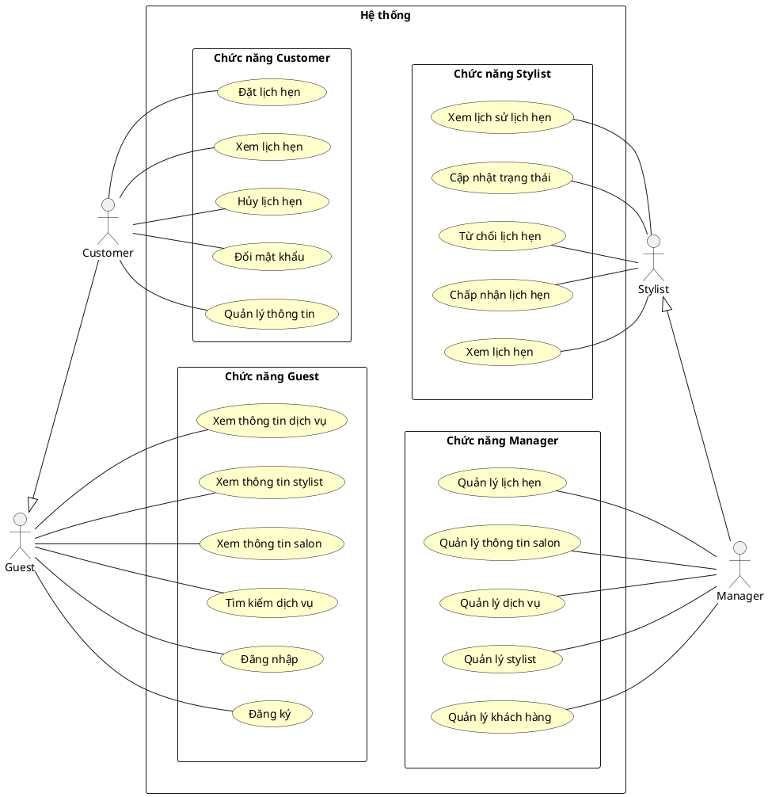

### Biểu đồ Use Case chi tiết

#### Chức năng Guest

Code PlantUML

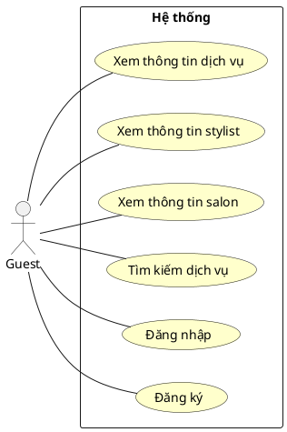

#### Chức năng Customer

Code PlantUML

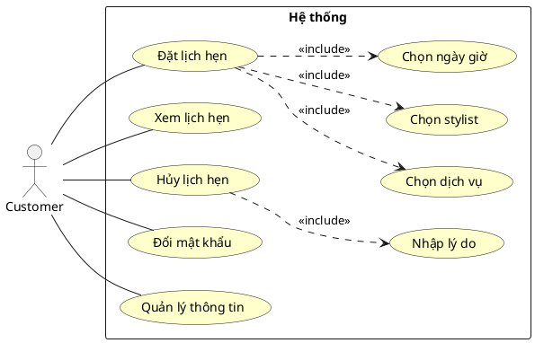

#### Chức năng Stylist

Code PlantUML

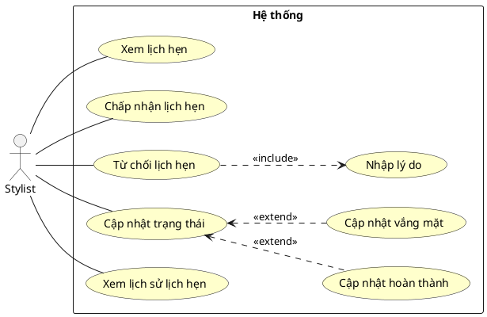

#### Chức năng Manager

Code PlantUML

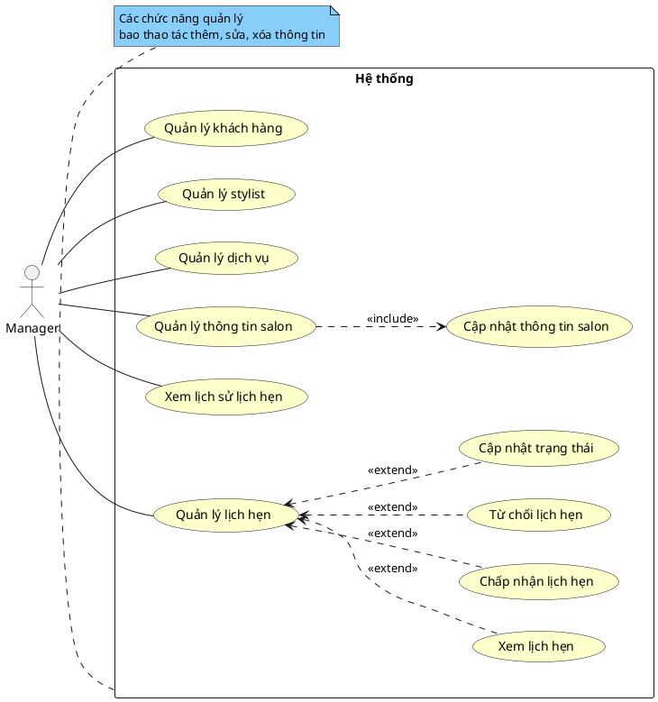

### Quy trình hoạt động

#### Quy trình đặt lịch hẹn

Code PlantUML

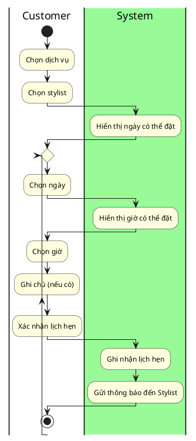

#### Quy trình cập nhật lịch hẹn

Code PlantUML

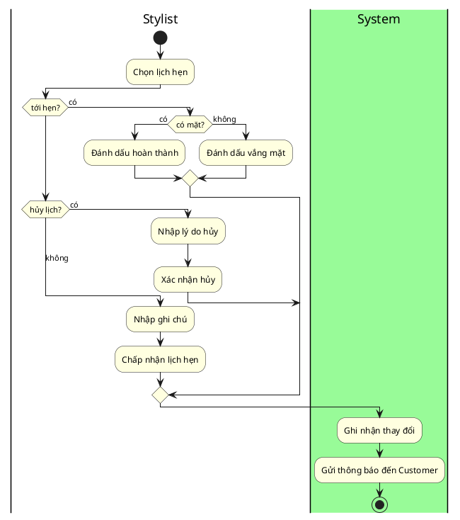

### Luồng xử lý

#### Luồng xử lý đăng ký

Code PlantUML

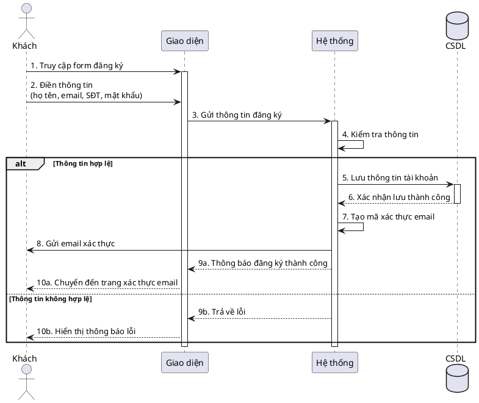

#### Luồng xử lý đặt lịch hẹn

Code PlantUML

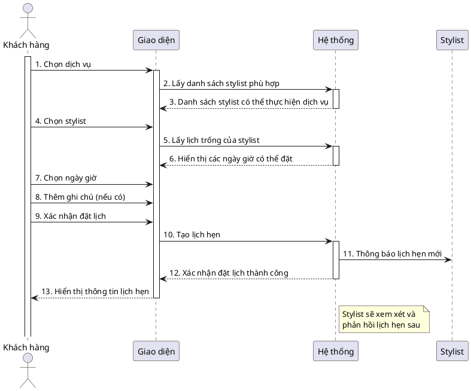

#### Luồng xử lý quản lý lịch hẹn

Code PlantUML

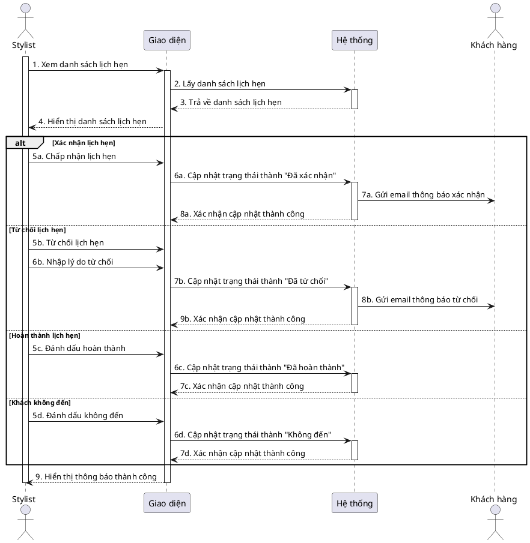

#### Luồng xử lý quản lý dịch vụ

Code PlantUML

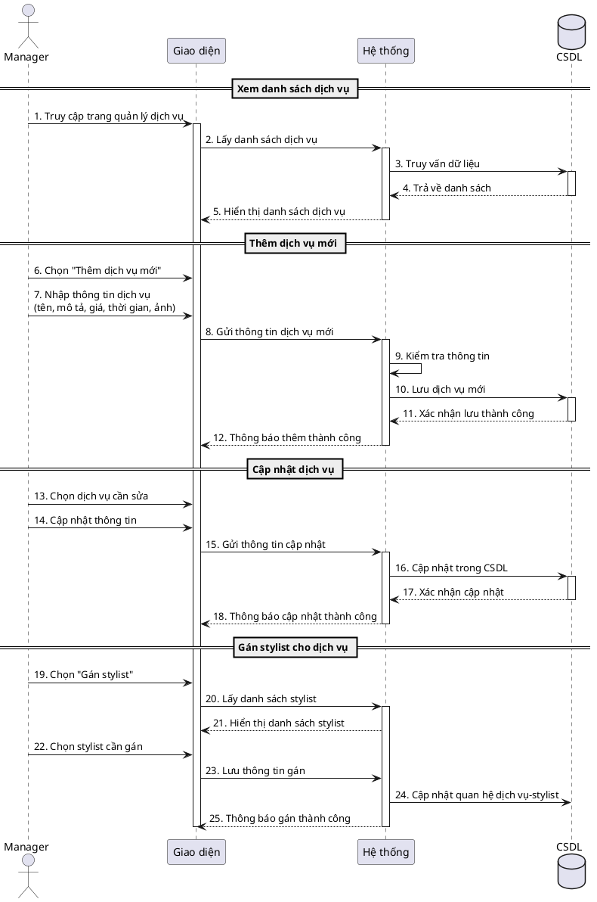

### Luồng dữ liệu

Code PlantUML

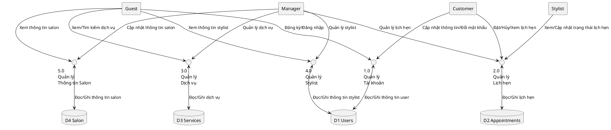

### Các trạng thái thực thể trong hệ thống

#### Trạng thái lịch hẹn

Code PlantUML

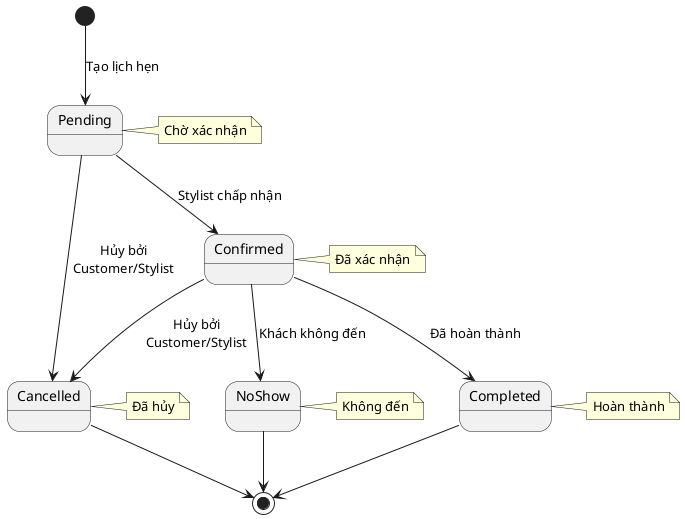

## III. Yêu cầu phi chức năng

### 1. Hiệu suất

* Thời gian tải trang không quá 3 giây
* Thời gian phản hồi API không quá 1 giây
* Hỗ trợ đồng thời ít nhất 30 người dùng
* Tối ưu hóa hình ảnh và tài nguyên

### 2. Bảo mật

* Mã hóa dữ liệu nhạy cảm trong cơ sở dữ liệu
* Bảo vệ chống tấn công SQL Injection
* Logging đầy đủ các hoạt động quan trọng
* Backup dữ liệu định kỳ

### 3. Khả năng mở rộng

* Kiến trúc module hóa, dễ thêm tính năng mới
* Khả năng tích hợp với các hệ thống bên thứ ba
* Dễ dàng nâng cấp phiên bản
* Documentation đầy đủ cho developers

### 4. Giao diện người dùng

* Thiết kế responsive cho mọi kích thước màn hình
* Thời gian học sử dụng không quá 30 phút
* Giao diện nhất quán trên toàn bộ hệ thống

### 5. Tương thích

* Hoạt động trên các trình duyệt phổ biến (Chrome, Firefox, Safari, Edge)
* Tương thích với các thiết bị di động iOS và Android
* Hỗ trợ các phiên bản trình duyệt từ 2 năm trở lại
* Tối ưu cho kết nối mạng chậm

### 6. Độ tin cậy

* Uptime tối thiểu 99.9%
* Thời gian phục hồi sau sự cố < 4 giờ
* Backup dữ liệu hàng ngày
* Có phương án dự phòng khi hệ thống gặp sự cố

### 7. Khả năng bảo trì

* Code được viết theo chuẩn clean code
* Tài liệu kỹ thuật chi tiết
* Dễ dàng rollback khi cần thiết

## IV. Công nghệ:

- **Frontend:** Sử dụng ReactJS để xây dựng giao diện người dùng.
- **Backend:** Sử dụng .NET để phát triển các dịch vụ backend.
- **API:** Sử dụng chuẩn REST API để giao tiếp giữa frontend và backend.
- **Cơ sở dữ liệu:** Sử dụng SQL Server để lưu trữ dữ liệu.
- **Bảo mật:** Sử dụng JWT để xác thực người dùng.
- **Thông báo:** Sử dụng email để thông báo cho người dùng.
- **Triển khai:** Sử dụng Docker để đóng gói và triển khai ứng dụng.
- **Quản lý mã nguồn:** Sử dụng Git để quản lý mã nguồn và GitHub để lưu trữ ma nguồn.

## V. Yêu cầu thiết kế

### Mô hình kiến trúc

Mô hình kiến trúc của hệ thống sẽ bao gồm các thành phần sau:

- **Client:** Giao diện người dùng, xây dựng bằng ReactJS, kết nối với API để lấy dữ liệu.
- **Server:** Dịch vụ API, xây dựng bằng ASP.NET Web API, sử dụng kiến trúc 3 lớp để xử lý logic.
    - **Presentation:** Xử lý các yêu cầu từ client, gọi các phương thức từ lớp Service.
    - **Business Logic:** Chứa logic xử lý chính của ứng dụng, gọi các phương thức từ lớp Repository.
    - **Data Access:** Tương tác với cơ sở dữ liệu, thực hiện các thao tác CRUD.
- **Database:** Cơ sở dữ liệu SQL Server, lưu trữ thông tin người dùng, lịch hẹn, dịch vụ...

Code PlantUML

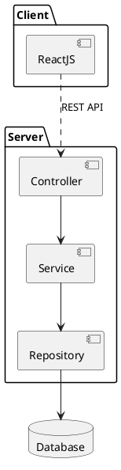

### Mô hình cơ sở dữ liệu

Cơ sở dữ liệu sẽ bao gồm các bảng sau:

- **Users:** Lưu thông tin người dùng, bao gồm tên, email, mật khẩu, quyền...
- **Appointments:** Lịch hẹn, bao gồm thông tin khách hàng, stylist, thời gian...
- **Services:** Dịch vụ, bao gồm tên, mô tả, giá cả...
- **Stylists:** Stylist, bao gồm tên, ảnh đại diện, kinh nghiệm...
- **Salon:** Thông tin salon, bao gồm địa chỉ, số điện thoại, giờ mở cửa...

Code PlantUML

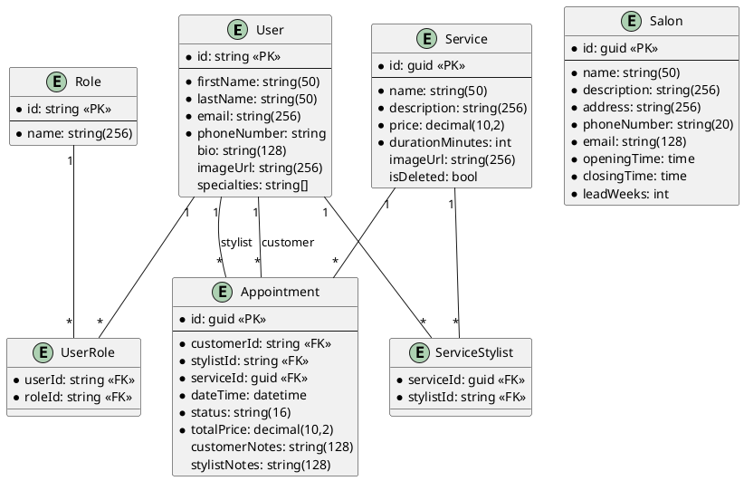

### Giao diện người dùng

Giao diện người dùng sẽ bao gồm các trang sau:

- **Trang chủ:** Hiển thị thông tin salon, các dịch vụ, stylist nổi bật.
- **Trang dịch vụ:** Hiển thị danh sách dịch vụ, cho phép tìm kiếm và xem chi tiết.
- **Trang đặt lịch hẹn:** Truy cập từ trang dịch vụ, cho phép chọn dịch vụ, stylist, ngày, giờ.
- **Trang cá nhân:** Hiển thị thông tin cá nhân, cho phép cập nhật thông tin, đổi mật khẩu, quản lý lịch hẹn.
- **Trang quản lý:** Dành cho stylist và quản lý, cho phép xem lịch hẹn, cập nhật trạng thái.
